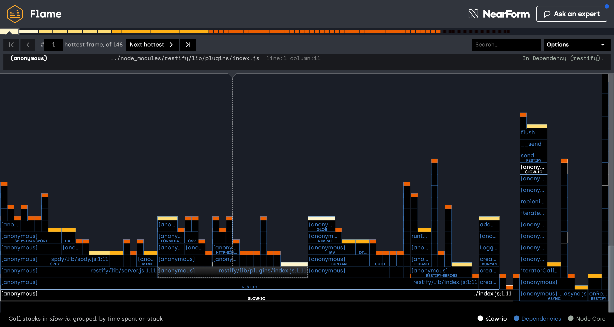

# Clinic.js Flame

[![npm version][npm-version]][npm-url] [![Stability Stable][stability-stable]][stability-docs] [![Github Actions build status][actions-status]][actions-url]
[![Downloads][npm-downloads]][npm-url] [![Code style][lint-standard]][lint-standard-url]

Programmable interface to [Clinic.js][clinic-url] Flame. Learn more about Clinic.js: https://clinicjs.org/



## Issues

To open an issue, please use the [main repository](https://github.com/clinicjs/node-clinic) with the `flame` label.

## Installation

```
npm i -S @clinic/flame
```

## Supported node versions

* Node.js 16 and above

## Example

```js
const ClinicFlame = require('@clinic/flame')
const flame = new ClinicFlame()

flame.collect(['node', './path-to-script.js'], function (err, filepath) {
  if (err) throw err

  flame.visualize(filepath, filepath + '.html', function (err) {
    if (err) throw err
  })
})
```

## Documentation

```js
const ClinicFlame = require('@clinic/flame')
const flame = new ClinicFlame()
```

### new ClinicFlame([settings])

* settings [`<Object>`][]
  * detectPort [`<boolean>`][] **Default**: false
  * debug [`<boolean>`][] If set to true, the generated html will not be minified.
    **Default**: false
  * dest [`<String>`][] The folder where the collected data is stored.
    **Default**: '.'
  * kernelTracing [`<boolean>`][] If set to true, it will use `linux_perf` to profile the application.
    (available only on linux) **Default**: false

#### `flame.collect(args, callback)`

Starts a process by using [0x](https://github.com/davidmarkclements/0x)

0x will produce a file in the current working directory, with the process PID in
its filename. The filepath relative to the current working directory will be the
value in the callback.

`stdout`, `stderr`, and `stdin` will be relayed to the calling process. As will
the `SIGINT` event.

#### `flame.visualize(dataFilename, outputFilename, callback)`

Will consume the datafile specified by `dataFilename`, this datafile will be
produced by the sampler using `flame.collect`.

`flame.visualize` will then output a standalone HTML file to `outputFilename`.
When completed the `callback` will be called with no extra arguments, except a
possible error.

## License
[MIT](LICENSE)

[stability-stable]: https://img.shields.io/badge/stability-stable-green.svg?style=flat-square
[stability-docs]: https://nodejs.org/api/documentation.html#documentation_stability_index
[npm-version]: https://img.shields.io/npm/v/@clinic/flame.svg?style=flat-square
[npm-url]: https://www.npmjs.org/@clinic/flame
[npm-downloads]: http://img.shields.io/npm/dm/@clinic/flame.svg?style=flat-square
[lint-standard]: https://img.shields.io/badge/code%20style-standard-brightgreen.svg?style=flat-square
[lint-standard-url]: https://github.com/feross/standard
[clinic-url]: https://github.com/clinicjs/node-clinic
[`<Object>`]: https://developer.mozilla.org/en-US/docs/Web/JavaScript/Reference/Global_Objects/Object
[`<boolean>`]: https://developer.mozilla.org/en-US/docs/Web/JavaScript/Data_structures#Boolean_type
[`<String>`]: https://developer.mozilla.org/en-US/docs/Web/JavaScript/Reference/Global_Objects/String
[actions-status]: https://github.com/clinicjs/node-clinic-flame/workflows/CI/badge.svg
[actions-url]: https://github.com/clinicjs/node-clinic-flame/actions
